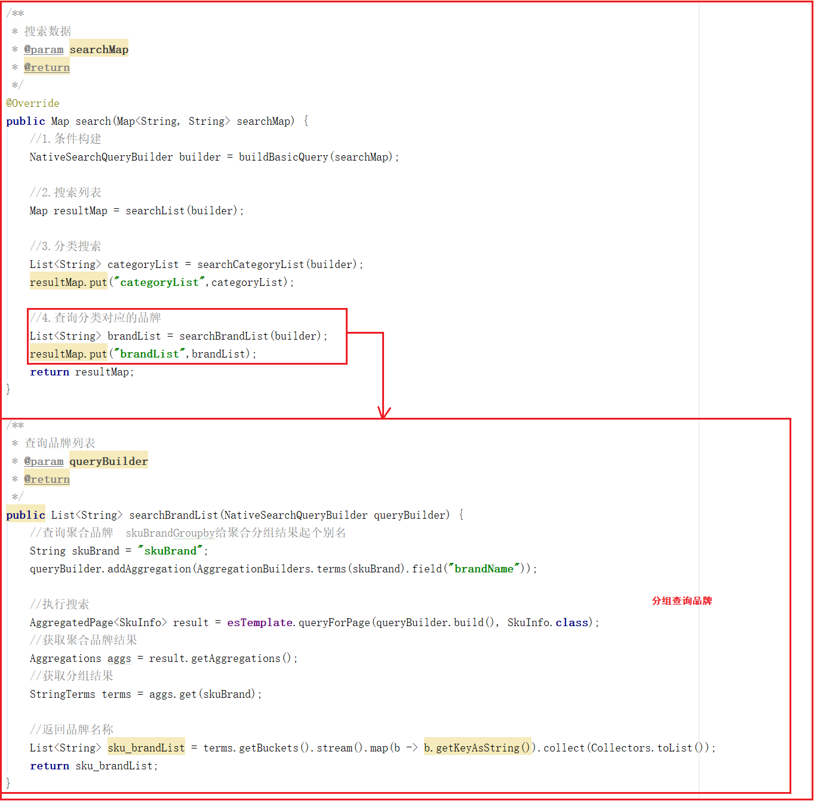
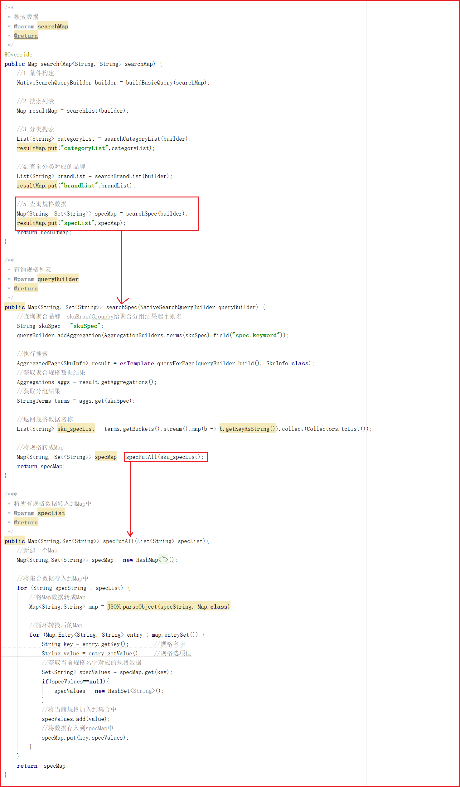
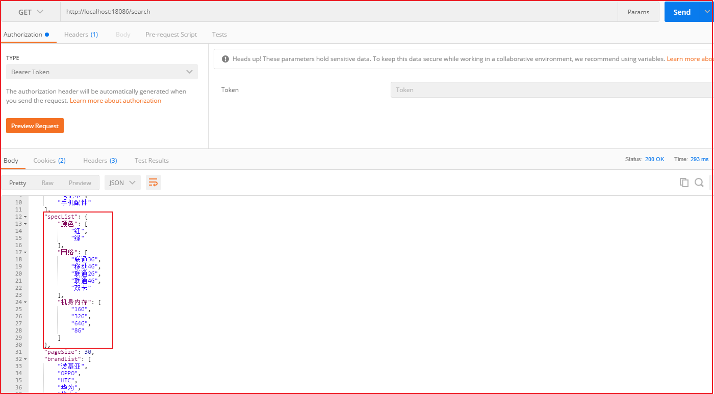
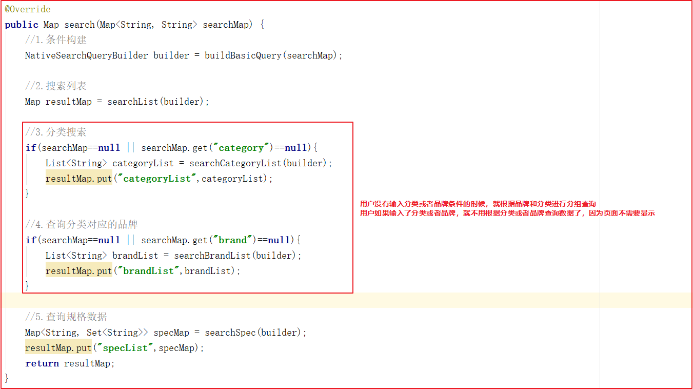

# 第6章 商品搜索

## 学习目标

- 条件筛选
- 多条件搜索[品牌、规格条件搜索]
- 规格过滤
- 价格区间搜索
- 搜索分页
- 搜索排序
- 搜索高亮


## 1. 品牌统计


用户搜索的时候，除了使用分类搜索外，还有可能使用品牌搜索，所以我们还需要显示品牌数据和规格数据，品牌数据和规格数据的显示比较容易，都可以考虑使用分类统计的方式进行分组实现。


### 1.1 品牌统计分析

看下面的SQL语句，我们在执行搜索的时候，第1条SQL语句是执行搜，第2条语句是根据品牌名字分组查看有多少品牌，大概执行了2个步骤就可以获取数据结果以及品牌统计，我们可以发现他们的搜索条件完全一样。

```sql
-- 查询所有
SELECT * FROM tb_sku WHERE name LIKE '%手机%';
-- 根据品牌名字分组查询
SELECT brand_name FROM  tb_sku WHERE name LIKE '%手机%' GROUP BY brand_name;
```

我们每次执行搜索的时候，需要显示商品品牌名称，这里要显示的品牌名称其实就是符合搜素条件的所有商品的品牌集合，我们可以按照上面的实现思路，使用ES根据分组名称做一次分组查询即可实现。


### 1.2 品牌分组统计实现

修改search微服务的com.changgou.search.service.impl.SkuServiceImpl类，添加一个品牌分组搜索，代码如下：



上图代码如下：

```java
/**
 * 搜索数据
 * @param searchMap
 * @return
 */
@Override
public Map search(Map<String, String> searchMap) {
    //...略

    //4.查询分类对应的品牌
    List<String> brandList = searchBrandList(builder);
    resultMap.put("brandList",brandList);
    return resultMap;
}

/**
 * 查询品牌列表
 * @param queryBuilder
 * @return
 */
public List<String> searchBrandList(NativeSearchQueryBuilder queryBuilder) {
    //查询聚合品牌  skuBrandGroupby给聚合分组结果起个别名
    String skuBrand = "skuBrand";
    queryBuilder.addAggregation(AggregationBuilders.terms(skuBrand).field("brandName"));

    //执行搜索
    AggregatedPage<SkuInfo> result = esTemplate.queryForPage(queryBuilder.build(), SkuInfo.class);
    //获取聚合品牌结果
    Aggregations aggs = result.getAggregations();
    //获取分组结果
    StringTerms terms = aggs.get(skuBrand);

    //返回品牌名称
    List<String> sku_brandList = terms.getBuckets().stream().map(b -> b.getKeyAsString()).collect(Collectors.toList());
    return sku_brandList;
}
```


### 1.3 测试

使用PostMan请求http://localhost:18086/search


思考：上面的代码看起来比较臃肿，能否进行简化呢？如果按照下面这种方式，将多个分组查询写到一起，实现一次查询效率会更高，同学们可以去实现一次：

```java
builder.addAggregation(AggregationBuilders.terms("skuCategory").field("categoryName"));
builder.addAggregation(AggregationBuilders.terms("skuBrand").field("brandName"));
//执行搜索
AggregatedPage<SkuInfo> skuPage = esTemplate.queryForPage(builder.build(), SkuInfo.class);

//获取所有分组查询的数据
Aggregations aggregations = skuPage.getAggregations();
//从所有数据中获取别名为skuCategory的数据
StringTerms terms = aggregations.get("skuCategory");
StringTerms brandTerms = aggregations.get("skuBrand");
```


## 2. 规格统计


用户搜索的时候，除了使用分类、品牌搜索外，还有可能使用规格搜索，所以我们还需要显示规格数据，规格数据的显示相比上面2种实现略微较难一些，需要对数据进行处理，我们也可以考虑使用分类统计和品牌统计的方式进行分组实现。


### 2.1 规格统计分析

看下面的SQL语句，我们在执行搜索的时候，第1条SQL语句是执行搜，第2条语句是根据规格分组查看有多少规格，大概执行了2个步骤就可以获取数据结果以及规格统计，我们可以发现他们的搜索条件完全一样。

```sql
-- 查询所有
SELECT * FROM tb_sku WHERE name LIKE '%手机%';
-- 根据规格名字分组查询
SELECT spec FROM  tb_sku WHERE name LIKE '%手机%' GROUP BY spec;
```

上述SQL语句执行后的结果如下图：


获取到的规格数据我们发现有重复，不过也可以解决，解决思路如下：

```
1.获取所有规格数据
2.将所有规格数据转换成Map
3.定义一个Map<String,Set>,key是规格名字，防止重复所以用Map，valu是规格值，规格值有多个，所以用集合，为了防止规格重复，用Set去除重复
4.循环规格的Map，将数据填充到定义的Map<String,Set>中
```


我们每次执行搜索的时候，需要显示商品规格数据，这里要显示的规格数据其实就是符合搜素条件的所有商品的规格集合，我们可以按照上面的实现思路，使用ES根据分组名称做一次分组查询，并去除重复数据即可实现。


### 2.2 规格统计分组实现

修改search微服务的com.changgou.search.service.impl.SkuServiceImpl类，添加一个规格分组搜索，代码如下：



上图代码如下：

```java
/**
 * 搜索数据
 * @param searchMap
 * @return
 */
@Override
public Map search(Map<String, String> searchMap) {
    //...略
    //5.查询规格数据
    Map<String, Set<String>> specMap = searchSpec(builder);
    resultMap.put("specList",specMap);
    return resultMap;
}

/**
 * 查询规格列表
 * @param queryBuilder
 * @return
 */
public Map<String, Set<String>> searchSpec(NativeSearchQueryBuilder queryBuilder) {
    //查询聚合品牌  skuBrandGroupby给聚合分组结果起个别名
    String skuSpec = "skuSpec";
    queryBuilder.addAggregation(AggregationBuilders.terms(skuSpec).field("spec.keyword"));

    //执行搜索
    AggregatedPage<SkuInfo> result = esTemplate.queryForPage(queryBuilder.build(), SkuInfo.class);
    //获取聚合规格数据结果
    Aggregations aggs = result.getAggregations();
    //获取分组结果
    StringTerms terms = aggs.get(skuSpec);

    //返回规格数据名称
    List<String> sku_specList = terms.getBuckets().stream().map(b -> b.getKeyAsString()).collect(Collectors.toList());

    //将规格转成Map
    Map<String, Set<String>> specMap = specPutAll(sku_specList);
    return specMap;
}

/***
 * 将所有规格数据转入到Map中
 * @param specList
 * @return
 */
public Map<String,Set<String>> specPutAll(List<String> specList){
    //新建一个Map
    Map<String,Set<String>> specMap = new HashMap<String,Set<String>>();

    //将集合数据存入到Map中
    for (String specString : specList) {
        //将Map数据转成Map
        Map<String,String> map = JSON.parseObject(specString, Map.class);

        //循环转换后的Map
        for (Map.Entry<String, String> entry : map.entrySet()) {
            String key = entry.getKey();        //规格名字
            String value = entry.getValue();    //规格选项值
            //获取当前规格名字对应的规格数据
            Set<String> specValues = specMap.get(key);
            if(specValues==null){
                specValues = new HashSet<String>();
            }
            //将当前规格加入到集合中
            specValues.add(value);
            //将数据存入到specMap中
            specMap.put(key,specValues);
        }
    }
    return  specMap;
}
```


### 2.3 测试

使用Postman测试访问http://localhost:18086/search  效果如下：




### 2.4 代码优化

用户每次如果点击了分类名字进行搜索，那么后台就不需要做分类分组了，如果点击了品牌搜索，那么后台就不需要做品牌分组了，当然规格这个是必须要做的。

修改changgou-service-search的com.changgou.search.service.impl.SkuServiceImpl的search方法，代码如下：




## 3 条件筛选 


用户有可能会根据分类搜索、品牌搜索，还有可能根据规格搜索，以及价格搜索和排序操作。根据分类和品牌搜索的时候，可以直接根据指定域搜索，而规格搜索的域数据是不确定的，价格是一个区间搜索，所以我们可以分为三段时间，先实现分类、品牌搜素，再实现规格搜索，然后实现价格区间搜索。


### 3.1 分类、品牌筛选

#### 3.1.1 需求分析

页面每次向后台传入对应的分类和品牌，后台据分类和品牌进行条件过滤即可。


#### 3.1.2 代码实现

修改搜索微服务com.changgou.search.service.impl.SkuServiceImpl的buildBasicQuery方法，添加分类和品牌过滤，代码如下：


上图代码如下：

```java
/***
 * 搜索条件构建
 * @param searchMap
 * @return
 */
public NativeSearchQueryBuilder buildBasicQuery(Map<String,String> searchMap){
    //构建条件
    NativeSearchQueryBuilder nativeSearchQueryBuilder = new NativeSearchQueryBuilder();

    //构建布尔查询
    BoolQueryBuilder queryBuilder = QueryBuilders.boolQuery();

    //条件组装
    if(searchMap!=null){
        //关键词
        if(!StringUtils.isEmpty(searchMap.get("keywords"))){
            queryBuilder.must(QueryBuilders.matchQuery("name",searchMap.get("keywords")));
        }

        //分类筛选
        if(!StringUtils.isEmpty(searchMap.get("category"))){
            queryBuilder.must(QueryBuilders.matchQuery("categoryName",searchMap.get("category")));
        }

        //品牌
        if(!StringUtils.isEmpty(searchMap.get("brand"))){
            queryBuilder.must(QueryBuilders.termQuery("brandName",searchMap.get("brand")));
        }
    }

    //添加过滤
    nativeSearchQueryBuilder.withQuery(queryBuilder);
    return nativeSearchQueryBuilder;
}
```


#### 3.1.3 测试

测试效果如下：

访问地址：http://localhost:18085/search


此时只能搜到华为手环设备


### 3.2 规格过滤

#### 3.2.1 需求分析


规格这一块，需要向后台发送规格名字以及规格值，我们可以按照一定要求来发送数据，例如规格名字以特殊前缀提交到后台：`spec_网络制式：电信4G、spec_显示屏尺寸：4.0-4.9英寸`

后台接到数据后，可以根据前缀spec_来区分是否是规格，如果以`spec_xxx`开始的数据则为规格数据，需要根据指定规格找信息。


上图是规格的索引存储格式，真实数据在spechMap.规格名字.keyword中，所以找数据也是按照如下格式去找：

`spechMap.规格名字.keyword`

1.2.2 代码实现

修改com.changgou.search.service.impl.SkuServiceImpl的buildBasicQuery方法，增加规格查询操作，代码如下：


上图代码如下：

```java
//规格
for(String key:searchMap.keySet()){
    //如果是规格参数
    if(key.startsWith("spec_")){
        queryBuilder.must(QueryBuilders.matchQuery("specMap."+key.substring(5)+".keyword", searchMap.get(key)));
    }
}
```


#### 3.2.3 测试

访问地址：http://localhost:18085/search


### 3.3 价格区间查询

#### 3.3.1 需求分析


价格区间查询，每次需要将价格传入到后台，前端传入后台的价格大概是`price=0-500`或者`price=500-1000`依次类推，最后一个是`price=3000`,后台可以根据-分割，如果分割得到的结果最多有2个，第1个表示`x<price`，第2个表示`price<=y`。


1.3.2 代码实现

修改com.changgou.search.service.impl.SkuServiceImpl的buildBasicQuery方法，增加价格区间查询操作，代码如下：


上图代码如下：

```java
//价格区间过滤
String price = searchMap.get("price");
if(!StringUtils.isEmpty(price)){
    //根据-分割
    String[] array = price.split("-");
    //x<price
    queryBuilder.must(QueryBuilders.rangeQuery("price").gt(array[0]));
    if(array.length==2){
        //price<=y
        queryBuilder.must(QueryBuilders.rangeQuery("price").lte(array[1]));
    }
}
```


#### 3.3.3 测试

访问地址：http://localhost:18085/search


效果如下(部分数据)：

```json
 [
        {
            "id": 1088256019328536576,
            "name": "守护宝幼儿安全手环",
            "price": 500,
            "num": 100,
            "image": "http://img10.360buyimg.com/n1/s450x450_jfs/t3457/294/236823024/102048/c97f5825/58072422Ndd7e66c4.jpg",
            "status": "1",
            "createTime": "2019-01-24T10:03:48.000+0000",
            "updateTime": "2019-01-24T10:03:48.000+0000",
            "isDefault": null,
            "spuId": 1088256019315953664,
            "categoryId": 1108,
            "categoryName": "户外工具",
            "brandName": "守护宝",
            "spec": "{\"颜色\":\"红\",\"机身内存\":\"64G\"}",
            "specMap": {
                "颜色": "红",
                "机身内存": "64G"
            }
        },
        {
            "id": 1088256014043713536,
            "name": "计步器小米手环，适用老人、小孩",
            "price": 800,
            "num": 100,
            "image": "http://img10.360buyimg.com/n1/s450x450_jfs/t3457/294/236823024/102048/c97f5825/58072422Ndd7e66c4.jpg",
            "status": "1",
            "createTime": "2019-01-24T10:03:47.000+0000",
            "updateTime": "2019-01-24T10:03:47.000+0000",
            "isDefault": null,
            "spuId": 1088256014026936320,
            "categoryId": 1192,
            "categoryName": "小家电",
            "brandName": "小米",
            "spec": "{\"颜色\":\"红\",\"机身内存\":\"64G\"}",
            "specMap": {
                "颜色": "红",
                "机身内存": "64G"
            }
        }
    ]
```


## 4 搜索分页

### 4.1 分页分析


页面需要实现分页搜索，所以我们后台每次查询的时候，需要实现分页。用户页面每次会传入当前页和每页查询多少条数据，当然如果不传入每页显示多少条数据，默认查询30条即可。


### 4.2 分页实现

分页使用PageRequest.of( pageNo- 1, pageSize);实现，第1个参数表示第N页，从0开始，第2个参数表示每页显示多少条，实现代码如下：


上图代码如下：

```java
/***
 * 搜索条件构建
 * @param searchMap
 * @return
 */
public NativeSearchQueryBuilder buildBasicQuery(Map<String,String> searchMap){
    //构建条件
    NativeSearchQueryBuilder nativeSearchQueryBuilder = new NativeSearchQueryBuilder();

    //构建布尔查询
    BoolQueryBuilder queryBuilder = QueryBuilders.boolQuery();

    //条件组装
    if(searchMap!=null){
        //...略
    }

    //分页
    Integer pageNo =pageConvert(searchMap);//页码
    Integer pageSize = 3;//页大小
    PageRequest pageRequest = PageRequest.of( pageNo- 1, pageSize);
    nativeSearchQueryBuilder.withPageable(pageRequest);

    //添加过滤
    nativeSearchQueryBuilder.withQuery(queryBuilder);
    return nativeSearchQueryBuilder;
}

/***
 * 获取当前页
 * 如果不发生异常，则直接转换成数字
 * 如果发生异常，则默认从第1页查询
 * @param searchMap
 * @return
 */
public Integer pageConvert(Map<String,String> searchMap){
    try {
        return Integer.parseInt(searchMap.get("pageNum"));
    } catch (Exception e) {
    }
    return 1;
}
```


测试如下：


## 5 搜索排序

### 5.1 排序分析


排序这里总共有根据价格排序、根据评价排序、根据新品排序、根据销量排序，排序要想实现非常简单，只需要告知排序的域以及排序方式即可实现。

价格排序：只需要根据价格高低排序即可，降序价格高->低，升序价格低->高

评价排序：评价分为好评、中评、差评，可以在数据库中设计3个列，用来记录好评、中评、差评的量，每次排序的时候，好评的比例来排序，当然还要有条数限制，评价条数需要超过N条。

新品排序：直接根据商品的发布时间或者更新时间排序。

销量排序：销量排序除了销售数量外，还应该要有时间段限制。


### 5.2 排序实现

这里我们不单独针对某个功能实现排序，我们只需要在后台接收2个参数，分别是排序域名字和排序方式，代码如下：


上图代码如下：

```java
//排序实现
String sortRule=searchMap.get("sortRule");//排序规则 ASC  DESC
String sortField=searchMap.get("sortField");//排序字段  price
if(!StringUtils.isEmpty(sortField)){
    nativeSearchQueryBuilder.withSort(SortBuilders.fieldSort(sortField).order(SortOrder.valueOf(sortRule)));
}
```

测试

根据价格降序：

```
{"keywords":"手机","pageNum":"1","sortRule":"DESC","sortField":"price"}
```

根据价格升序：

```
{"keywords":"手机","pageNum":"1","sortRule":"ASC","sortField":"price"}
```


## 6 高亮显示

### 6.1 高亮分析


高亮显示是指根据商品关键字搜索商品的时候，显示的页面对关键字给定了特殊样式，让它显示更加突出，如上图商品搜索中，关键字编程了红色，其实就是给定了红色样式。


### 6.2 高亮搜索实现步骤解析

将之前的搜索换掉，换成高亮搜索，我们需要做3个步骤：

```
1.指定高亮域，也就是设置哪个域需要高亮显示
  设置高亮域的时候，需要指定前缀和后缀，也就是关键词用什么html标签包裹，再给该标签样式
2.高亮搜索实现
3.将非高亮数据替换成高亮数据
```

第1点，例如在百度中搜索数据的时候，会有2个地方高亮显示，分别是标题和描述，商城搜索的时候，只是商品名称高亮显示了。而高亮显示其实就是添加了样式，例如`<span style="color:red;">笔记本</span>`,而其中span开始标签可以称为前缀，span结束标签可以称为后缀。

第2点，高亮搜索使用ElasticsearchTemplate实现。

第3点，高亮搜索后，会搜出非高亮数据和高亮数据，高亮数据会加上第1点中的高亮样式，此时我们需要将非高亮数据换成高亮数据即可。例如非高亮:`华为笔记本性能超强悍`  高亮数据：`华为<span style="color:red;"笔记本</span>性能超强悍`,将非高亮的换成高亮的，到页面就能显示样式了。


### 6.3 高亮代码实现

删掉之前com.changgou.search.service.impl.SkuServiceImpl的searchList方法搜索代码，用下面高亮搜索代码替换：


上图代码如下：

```java
/***
 * 数据搜索
 * @param builder
 * @return
 */
private Map searchList(NativeSearchQueryBuilder builder){
    Map resultMap=new HashMap();//返回结果
    //高亮域配置
    HighlightBuilder.Field field = new HighlightBuilder.
            Field("name").                      //指定的高亮域
            preTags("<span style=\"color:red\">").   //前缀
            postTags("</span>").                      //后缀
            fragmentSize(100);

    //添加高亮域
    builder.withHighlightFields(field);

    NativeSearchQuery searchQuery = builder.build();
    //分页搜索
    AggregatedPage<SkuInfo> skuPage = esTemplate.queryForPage(searchQuery, SkuInfo.class, new SearchResultMapper() {
        @Override
        public <T> AggregatedPage<T> mapResults(SearchResponse response, Class<T> clazz, Pageable pageable) {
            //定义一个集合存储所有高亮数据
            List<T> list = new ArrayList<T>();

            //循环所有数据
            for (SearchHit hit : response.getHits()) {
                //获取非高亮数据           例如：小白真美丽      {"name":"张三","age":27}
                SkuInfo skuInfo = JSON.parseObject(hit.getSourceAsString(), SkuInfo.class);

                //获取高亮数据            例如：小白真 <span style="color:red;">美丽</span>
                HighlightField titleHighlight = hit.getHighlightFields().get("name");      //获取标题的高亮数据

                if (titleHighlight != null) {
                    //定义一个字符接收高亮数据
                    StringBuffer buffer = new StringBuffer();
                    //循环获取高亮数据
                    for (Text text : titleHighlight.getFragments()) {
                        //text.toString():   小白真<span style="color:red;">美丽</span>啊
                        buffer.append(text.toString());
                    }
                    //将非高亮数据替换成高亮数据    小白真美丽-->小白真 <span style="color:red;">美丽</span>
                    skuInfo.setName(buffer.toString());
                }

                //将高亮数据返回
                list.add((T) skuInfo);
            }
            //1：返回的集合数据   2：分页数据   3：总记录数
            return new AggregatedPageImpl<T>(list, pageable, response.getHits().getTotalHits());
        }
    });

    resultMap.put("rows",skuPage.getContent());
    resultMap.put("totalPages",skuPage.getTotalPages());
    return resultMap;
}
```


### 6.4 测试


效果如下：

```
"name": "HTC M8Sd (E8) 波尔多红 电信4G<span style=\"color:red\">手机</span> 双卡双待双通",
```


## 7 分组综合

(学员完成)

上面的分组搜索比较的臃肿，而且请求次数比较多，可以按照如下流程进行优化。

```java
/****
 * 分组搜索实现
 * @param nativeSearchQueryBuilder
 * @return
 */
public Map groupList(NativeSearchQueryBuilder nativeSearchQueryBuilder, Map<String,String> searchMap){
    /****
     * 根据分类名字|品牌名字|规格进行分组查询
     * 1:给当前分组取一个别名
     * 2:分组的域的名字
     */
    nativeSearchQueryBuilder.addAggregation(AggregationBuilders.terms("skuSpec").field("spec.keyword"));
    if(searchMap==null || StringUtils.isEmpty(searchMap.get("category"))){
        //分类
        nativeSearchQueryBuilder.addAggregation(AggregationBuilders.terms("skuCategory").field("categoryName"));
    }
    if(searchMap==null || StringUtils.isEmpty(searchMap.get("brand"))){
        //品牌合并分组查询
        nativeSearchQueryBuilder.addAggregation(AggregationBuilders.terms("skuBrand").field("brandName"));
    }

    //实现分组搜索
    AggregatedPage<SkuInfo> categoryPage = esTemplate.queryForPage(nativeSearchQueryBuilder.build(), SkuInfo.class);
    //获取所有分组数据
    Aggregations aggregations = categoryPage.getAggregations();

    //存储所有数据
    Map groupMap = new HashMap();

    //获取规格数据
    List<String> specList = getGroupData(aggregations, "skuSpec");
    Map<String, Set<String>> specMap = putAllSpec(specList);
    groupMap.put("specList",specMap);

    //分类分组实现
    if(searchMap==null || StringUtils.isEmpty(searchMap.get("category"))){
        List<String> categoryList = getGroupData(aggregations,"skuCategory");
        groupMap.put("categoryList",categoryList);
    }

    //品牌分组实现
    if(searchMap==null || StringUtils.isEmpty(searchMap.get("brand"))){
        List<String> brandList = getGroupData(aggregations,"skuBrand");
        groupMap.put("brandList",brandList);
    }
    return groupMap;
}
```

